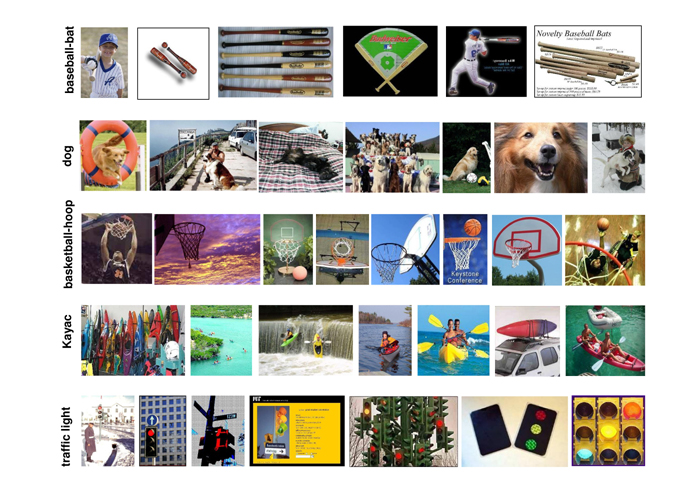

# Pattern Recognition Project
PatternRecognition 191008 ~ 191214

---
 

# Subscription  

## Reference  
This Project is based on ["Beyond Bags of Features: Spatial Pyramid Matching for Recognizing Natural Scene Categories"](http://vision.stanford.edu/teaching/cs231b_spring1213/papers/CVPR06_LazebnikSchmidPonce.pdf)-_CVPR 2006_-	
and about class assignment in Pattern Recognition, School of Intelligent Mechatronics Engineering Sejong University.  	

## Project Abstract	
This Project opened through Kaggle Competition. and kaggle dataset consists of validated [Caltech 101](http://www.vision.caltech.edu/Image_Datasets/Caltech101/) dataset based paper.
(kaggle link : [2019-ml-finalproject](https://www.kaggle.com/c/2019-ml-finalproject/))
  
This Project is administered by gitkraken.  	
I know that how to use gitbash command. but invention spped is accelerated by new tools. This tool are very powerful in seeing the comment,branch, and error of your team. So, I will study Gitkraken and upload manual for classmates. This tool maybe easily create and delete branch and administer your team, faster than gitbash.	

reference papers.pdf is in the study folder.  	
Except for it, other things are related Project.  	

 
  
### Caltech 101 Dataset
- Pictures of objects belonging to 101 categories. About 40 to 800 images per category. Most categories have about 50 images. Collected in September 2003 by Fei-Fei Li, Marco Andreetto, and Marc 'Aurelio Ranzato.  The size of each image is roughly 300 x 200 pixels.
- We have carefully clicked outlines of each object in these pictures, these are included under the 'Annotations.tar'. There is also a matlab script to view the annotaitons, 'show_annotations.m'.  

[Caltech 101 Dataset Sample]

 

---
# Last Submit : 0.61 ver

- LINK : [https://github.com/chldydgh4687/PRproject/tree/0.61_](https://github.com/chldydgh4687/PRproject/tree/0.61_)
 

- 0.59 (spm.ver) >> 0.61
- 2_depth(SPM) + HOG + SPM(kernel)
- codebook 200 >> 800 조정

---  
 

# Git Managing

## Branch  
- master  
Master branch is Last Release.ver, Final version  

- 0.4x
It is latest version of versions before 0.5

- 0.5x
It is latest version of versions before 0.6

- 0.6x
It is latest version of versions before 0.7

- Develop   	
Develop branch is developing codition, literally. 	
other words, revision version. version before merged into master.  	
  
- Hotfix    	
when critical bug and error occur in this project, this branch is useful.	
In this case of bug fixed in it, also this branch merged into master.

## Release / Tags
 

- 0.61(Final.ver)
- 0.59(spm_feature + scaler)
- 0.57(spm_image)
- 0.52(spm_base)
- 0.50(not_spm_kernel)
- 0.41(0_depth_spm)

---  

## Reference
 

[TrungTVo/spatial-pyramid-matching-scene-recognition](https://github.com/TrungTVo/spatial-pyramid-matching-scene-recognition)  

[kaggle_discussion](https://www.kaggle.com/c/2019-ml-finalproject/discussionn)

